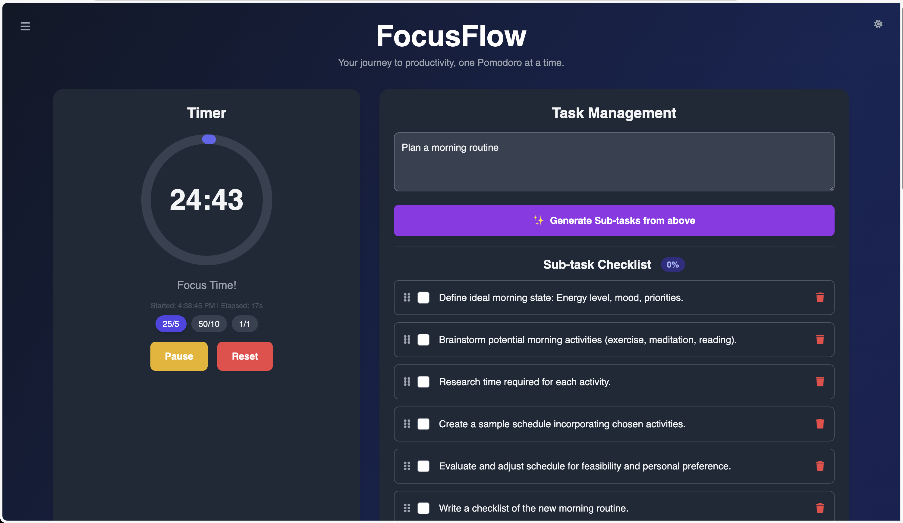

# 🎯 FocusFlow - Gamified Pomodoro Timer

> **Transform your productivity with AI-powered task management and gamified focus sessions**

[](assets/screenshots/screenshot.png)

FocusFlow combines the proven Pomodoro Technique with modern gamification and AI to make productivity actually enjoyable. Earn credits, unlock rewards, and watch your focus sessions transform into a rewarding journey toward your goals.

## ✨ Why FocusFlow?

- 🎮 **Gamified Productivity** - Turn work into a game with credits, perks, and achievements
- 🤖 **AI-Powered Task Breakdown** - Let Google Gemini break complex tasks into manageable subtasks
- 📊 **Smart Session Tracking** - Detailed analytics to understand your productivity patterns
- 🎁 **Customizable Rewards** - Create your own break activities and rewards
- 🌙 **Beautiful Dark/Light Themes** - Eye-friendly interface that adapts to your preference
- ⚡ **Multiple Timer Modes** - 25/5, 50/10, or create your own custom durations
- 💾 **Seamless Auto-Save** - Never lose your progress with automatic state persistence
- 📱 **Progressive Web App** - Install on any device and use like a native app

## 🚀 Quick Start

### Option 1: Try It Now
1. **Clone the repository**
   ```bash
   git clone https://github.com/vryanj/focusflow.git
   cd focusflow
   ```

2. **Open in your browser**
   ```bash
   # If you have Python installed
   python -m http.server 8000
   
   # Or simply open index.html in your browser
   ```

3. **Start focusing!** 🎯

### Option 2: Deploy to Your Server
- Upload all files to your web server
- Ensure HTTPS is enabled (required for PWA features)
- Access via your domain

## 🎯 How FocusFlow Works

### 1. **Set Your Mission** 🎯
Enter your main task - whether it's "Write a blog post" or "Learn React"

### 2. **AI-Powered Breakdown** 🤖
Click "Generate Sub-tasks" and watch AI break your complex task into focused 25-minute sessions

### 3. **Choose Your Flow** ⏱️
Select from preset modes (25/5, 50/10) or create custom durations that match your energy levels

### 4. **Earn & Reward** 💎
Complete focus sessions to earn credits, then spend them on custom break activities you've created

### 5. **Track Your Journey** 📈
Review detailed session history, productivity patterns, and celebrate your progress

## 🛠️ Configuration

### AI Features Setup (Optional but Recommended)
FocusFlow's AI task breakdown feature requires a Google Gemini API key:

1. **Get Your Free API Key**
   - Visit [Google AI Studio](https://ai.google.dev/gemini-api/docs/quickstart)
   - Create a new project and get your API key (free tier available)

2. **Configure in FocusFlow**
   - Open the app and click the menu (☰) → Settings
   - Enter your API key
   - Your key is stored locally and never shared

> **Note**: FocusFlow works perfectly without an API key - you'll just need to create subtasks manually!

### Customization Options
- **Add Custom Perks**: Create your own reward activities
- **Adjust Timer Modes**: Set custom focus/break durations
- **Theme Preferences**: Switch between light and dark modes
- **Session Management**: Export, clear, or restore previous sessions

## 📱 Progressive Web App Features

FocusFlow is a full-featured PWA that works offline:

- **Install on Any Device**: Add to home screen on iOS, Android, or desktop
- **Offline Functionality**: Core features work without internet
- **Native App Experience**: Smooth animations and responsive design
- **Auto-Updates**: Always get the latest version

## 🎨 Screenshots & Demo


*The beautiful, intuitive interface that makes productivity enjoyable*

## 🏗️ Technical Stack

- **Frontend**: Vanilla JavaScript (ES6+)
- **Styling**: Tailwind CSS with custom animations
- **AI Integration**: Google Gemini API
- **Storage**: LocalStorage with automatic state management
- **PWA**: Service Worker for offline functionality
- **Icons**: Font Awesome & Custom SVG icons
- **Versioning**: Semantic Versioning with automated version management

## 🤝 Contributing

We love contributions! Here's how you can help:

1. **Fork the repository**
2. **Create a feature branch** (`git checkout -b feature/amazing-feature`)
3. **Commit your changes** (`git commit -m 'Add amazing feature'`)
4. **Push to the branch** (`git push origin feature/amazing-feature`)
5. **Open a Pull Request**

### Development Setup
```bash
# Install dependencies (if using npm scripts)
npm install

# Start development server
npm run dev
```

### Version Management
FocusFlow uses semantic versioning with automated version management:

```bash
# Check current version
npm run version

# Bump patch version (1.1.0 → 1.1.1)
npm run version:patch

# Bump minor version (1.1.0 → 1.2.0)
npm run version:minor

# Bump major version (1.1.0 → 2.0.0)
npm run version:major

# Sync version across all files
npm run version:sync
```

**Version Files:**
- `VERSION.md` - Single source of truth
- `package.json` - NPM version
- `sw.js` - PWA cache version
- `CHANGELOG.md` - Detailed change history

## 📄 License

This project is licensed under the MIT License - see the [LICENSE](LICENSE) file for details.

## 🙏 Acknowledgments

- **Pomodoro Technique®** - The foundation of focused work sessions
- **Google Gemini AI** - Powerful AI for intelligent task breakdown
- **Tailwind CSS** - Beautiful, utility-first CSS framework
- **Font Awesome** - Amazing icon library
- **Progressive Web Apps** - Making web apps feel native

---

**Made with ❤️ by VRJ**

*Transform your productivity today with FocusFlow - where focus meets fun!*
